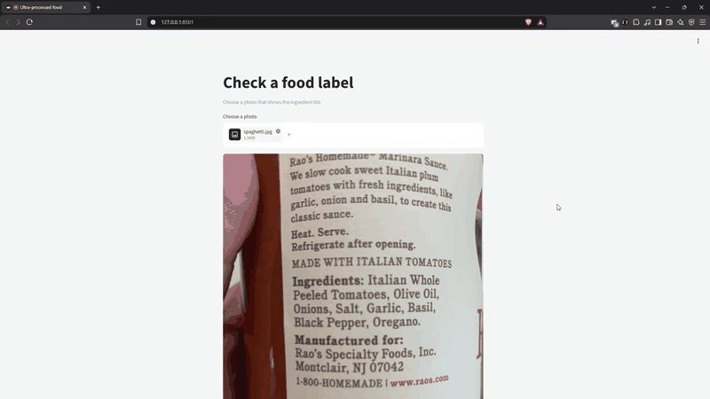

# Ultra-processed food scanner (web)

A Python page you can host on your own machine. Submit a photo that shows an ingredient list. The page asks the scanner in the original project, and shows that result. There is no account step, and this page does not classify the list itself. A photo sent here is not saved: no product, picture, or ingredient row is written.

## Demo



A photo of a pasta sauce jar goes in, and the card shows **Group 3: Processed foods** with the ingredient list. [Watch the full recording](docs/demo.webm) (11 seconds; a live scan can take about 40 seconds).

The scanner that makes this decision is a separate project, so this repository cannot run on its own. The recording shows it working. The sections below explain how it runs when the scanner is next to it.

## Requirements

- The original project next to this folder, at `../Ultra-processed-food`
- That project's Python, which already has the scanner's libraries, plus Streamlit (`..\Ultra-processed-food\apps\Scripts\python.exe -m pip install streamlit`)
- Ollama running with the scanner's vision model
- The review database running (the `upf-dev-pg` container) and `OWNER_REVIEWER_PASSWORD` set in the original project's `.env`. The scanner reads its released knowledge base from there, and the page stops at startup if it cannot.

If the original project is somewhere else, set `UPF_SCANNER_ROOT` to its folder before starting.

## Host it locally

From this folder:

```bash
..\Ultra-processed-food\apps\Scripts\python.exe -m streamlit run streamlit_app.py
```

Open [http://127.0.0.1:8501](http://127.0.0.1:8501). The settings are in `.streamlit/config.toml`. The page listens on this machine only.

To record a demo, open the menu at the top right of the page and choose **Record a screencast**. Your browser asks what to share; pick this tab, scan a photo, then stop the recording and the video downloads. Run one scan first so the model is loaded and the recording is not mostly waiting.

The plain Python page does the same job and needs no Streamlit:

```bash
..\Ultra-processed-food\apps\Scripts\python.exe server.py
```

Open [http://127.0.0.1:3000](http://127.0.0.1:3000).

Choose a photo of the ingredient list, then choose Check this photo. The first scan after a break can take a minute while the model loads. The result stays on the page until you choose Okay.

## What a result means

The card uses the phone's words. A confirmed scan shows Group 1, 2, 3, or 4. An ingredient the scanner has not settled, and that could still be a marker, shows "Likely ultra-processed, being verified." A photo with no readable list asks for another photo and does not show a group. The same is true of a screenshot, a picture with no food, a list that is cut off, and a product that is not a food or a drink. The sentence on the card is the one the scanner already uses.
